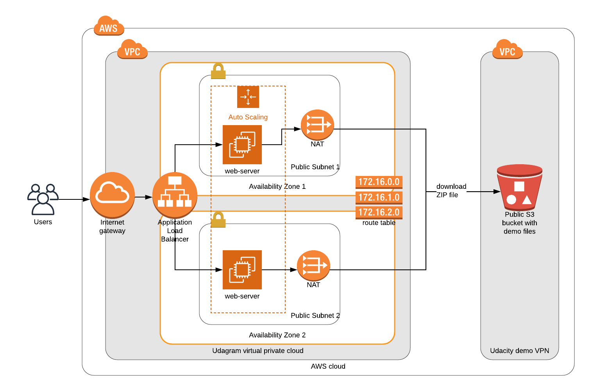
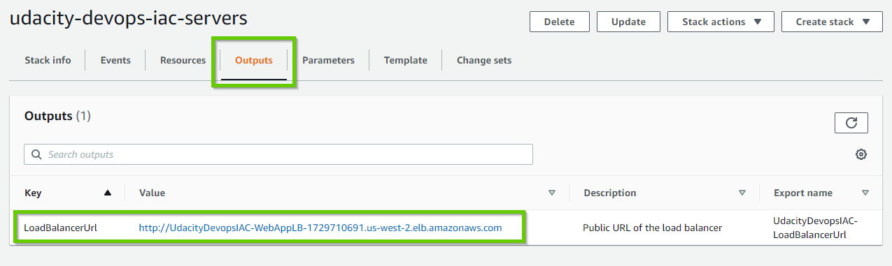

# Deploy Infrastructure as Code (IAC) Project




## Setup

### Prerequisites
- AWS CLI tool version 2 installed
    - Installation instructions: https://docs.aws.amazon.com/cli/latest/userguide/install-cliv2-linux.html
- AWS key with programmatic access and admin permissions

Configure AWS console:
```bash
aws configure
# Default region: us-west-2
```

### Deployment

To make it easier to understand and debug the deployment process is splitted in two parts:
- Deploy network infrastructure in CloudFormation stack "udacity-devops-iac-network"
- Deploy servers in CloudFormation stack "udacity-devops-iac-servers"

The first stack prepares infrastructure and outputs the IDs of created resources in the CloudFormation context. The second script uses  that resources to deploy web-servers, create target group and load-balancer.

#### Deploy network

Create network stack from YAML:
```bash
./create-network.sh
```

Optional. Update existing network stack with the new configuration:
```bash
./update-network.sh
```

The network stack exposes parameters that are then used in the servers stack. 

#### Deploy servers

Create servers stack from YAML:
```bash
./create-servers.sh
```

Optional. Update servers stack with the new configuration:
```bash
./update-servers.sh
```

This script creates a redundant cluster of load-balanced web servers and outputs the public URL of the web-site to CloudFront variable:



## Cleanup

When finished, you can delete both CloudFormation stacks created above to free resources and reduce AWS costs:

```bash
aws cloudformation delete-stack --stack-name udacity-devops-iac-servers
aws cloudformation delete-stack --stack-name udacity-devops-iac-network
```